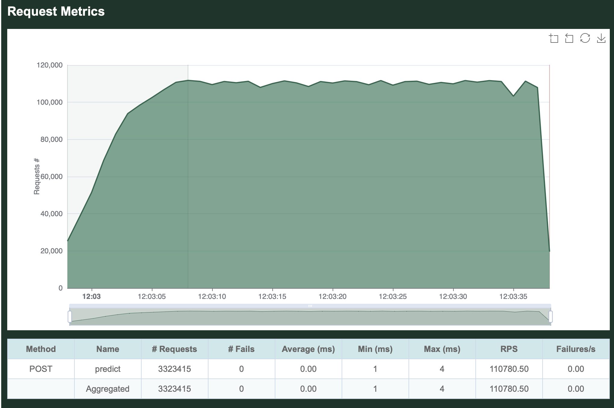

# Inferer Task

## Introduction
Given a model file exported from PyTorch/StableBaseline3, this tool streamlines the process of running inference on the model by following these steps:
1. The build time Rust script (build.rs) uses Foreign Function Interface (FFI) to interface with Python and perform the following:
    - Read the `policy.pth` file (as this is not easily done in Rust).
    - Extract the policy_net's layers, ignoring the value_net layers stored in the same file (they are different networks).
    - Reformat the relevant weights and biases using a custom Cap'n Proto schema that is accessible from Rust.
    - Store the reformatted data in a file (model.o).
2. The second part of the build script automatically generates Rust code (model_capnp.rs) using the aforementioned custom schema (cereal/model.capnp).
3. The generated code is then used to decode the model.o file, and load the weights and biases into memory.
4. Using the crate [dfdx](https://docs.rs/dfdx/latest/dfdx/), we initialize a three-layer NN with the values just loaded into memory and build a predict method that receives a state and outputs an action (model.rs).
5. With [warp](https://docs.rs/warp/latest/warp/), we expose the predict function with a simple and lightweight REST service.

It's been quite fun putting this together! What I found to be the most interesting part was, that given a known model architecture, all the above steps could be auto-generated.
I will most likely spend some time in the near future hacking a prototype of this :)

## How to run
The project is split into 2 main modules, the executable and the library, for better re-usability. The executable is a CLI program that starts the server.

### Build and run the executable
I'm assuming cargo and Rust are installed, if not follow the steps here https://www.rust-lang.org/learn/get-started. 

The project requires the capnp tool. Install it with:

```
# Debian/Ubuntu
apt-get install capnproto

# MacOS
brew install capnp
```
For more help visit their [website](https://capnproto.org/install.html).

The build script needs some Python dependencies to work, so run:
`pip install pycapnp torch`

Make sure there's a `policy.pth` file inside the `model/` folder. If you don't have it, download the (CartPole-v1.zip)[https://huggingface.co/sb3/ppo-CartPole-v1/resolve/main/ppo-CartPole-v1.zip], unzip it and place the `policy.pth` file in the `model/` folder.

By running the following command, the build and execution steps will run sequentially:
`cargo run --release server 0.0.0.0:8080`

That will run the build script, build the binary in "release" mode and start the server on port `8080`.
The server exposes a POST endpoint `/predict` that accepts a JSON body representing the state. It will then compute the action to take and return it as a JSON. A request might look like this:
```
$ curl -H "content-type: application/json" localhost:8080/predict -d \
  '{ 
    "cart_position": -0.04568531, 
    "cart_velocity":  -0.14921477, 
    "pole_angle": 0.01811073, 
    "pole_angular_velocity": 0.28565928 
  }'
```

Returning something like this:
```
{"action":1}
```

## Results
Benchmark time! Beside some simple tests making sure the NN gives us accurate results, benchmarks are our metric of success.
What are we trying to achieve here? Well, the model is already trained, so being able to run the model on a server while staying performant, is our key to victory!
I took the liberty of also writing a very simple Python server (please mind that my knowledge of performant web Python is scarce) to compare performance ([server.py](server.py)).

The benchmarking was done with a library called `goose`. It automates benchmarking through load/stress tests. A 30 second load test was run on both servers, with all available threads making as many requests as possible. The code can be found in the `benchmarks/` folder.
The metrics that we're interested in are Requests Per Second (RPS), latency, and how many errors we encounter. _Why?_ Because these metrics allow us to predict:

  - **Scalability**: RPS give us an indication of how well the server can handle an increasing number of requests.
  - **Performance**: Latency measures the time it takes for the server to respond to a request. The less latency we experience, the more performant our server is.
  - **Stability**: Monitoring the number of errors per second can help us identify any stability issues with the server. Doesn't matter how performant the server is if it timeouts a third of the requests.

### MacBook Pro M1 Max (10 cores)
**Python**:


**Rust**:


Rust handled 400x more Requests Per Second than Python. 110780 RPS! (on average).

Also, throughout all 3323415 requests, Rust didn't timeout a single one of them. Meanwhile, Python seemed to error twice every second.
(We can clearly see that Python completely throttled during the benchmark, making any metrics unfair, since those are only accurate under heavy traffic. Still a good point of reference though.)

### AMD Ryzen 9 5900X (24 cores)
I decided to run the same benchmarks on a beefier machine running Ubuntu 20.04.

**Python**:


**Rust**:


Python seemed to put more of a fight but still nothing compared to Rust's performance. Rust showcased an average of 207k RPS while Python got stuck at 1.1k. The performance here was 200x, instead of 400x.

Overall, this time Rust improved on an already impressive performance while Python seemed to at least stabilize.

(You can find the full report.html files in the `benchmarks/` folder)

### Run the benchmarks!
If you're feeling skeptical... run the benchmarks on your machine!
The `benchmarks/` folders contains another Rust project with an executable. To try benchmarking by yourself, run:
```
$ cd benchmarks/
$ cargo run --release -- --host http://localhost:8080/ --report-file=your-custom-report.html -t 30s
```
Remember to start the server before running the benchmarks!
